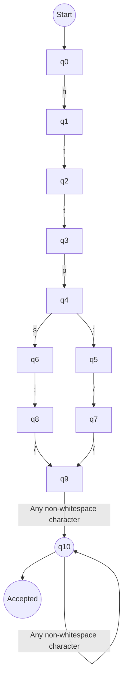

# DFA State Transition Diagram – URL Validation

```mermaid
flowchart TD
    A((Start)) --> q0[q0]

    q0 -->|h| q1[q1]
    q1 -->|t| q2[q2]
    q2 -->|t| q3[q3]
    q3 -->|p| q4[q4]

    q4 -->|:| q5[q5]
    q4 -->|s| q6[q6]

    q5 -->|/| q7[q7]
    q6 -->|:| q8[q8]

    q8 -->|/| q9[q9]
    q7 -->|/| q9

    q9 -->|Any non-whitespace character| q10((q10))
    q10 -->|Any non-whitespace character| q10

    q10 --> F((Accepted))
```
